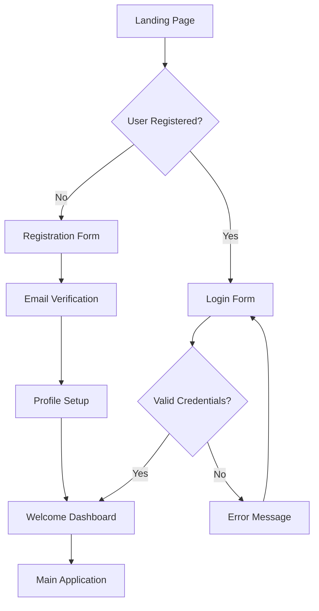
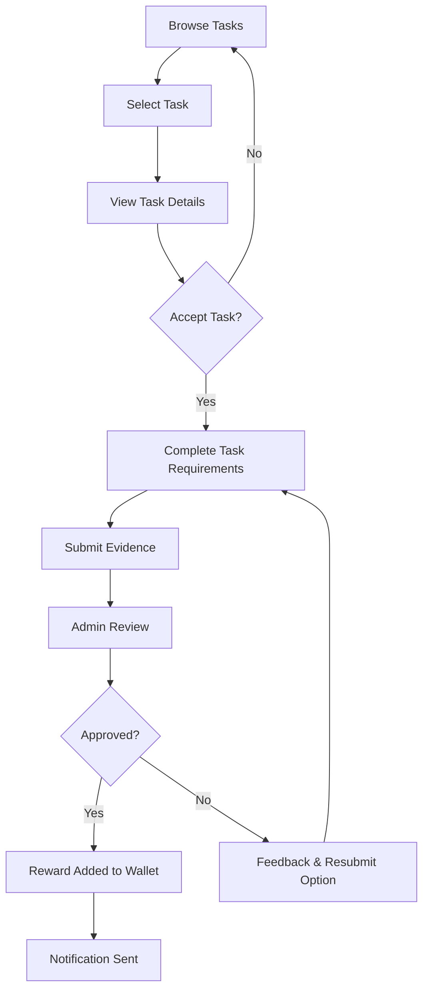
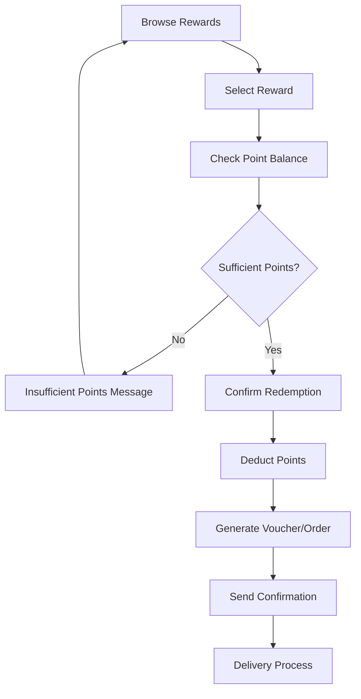
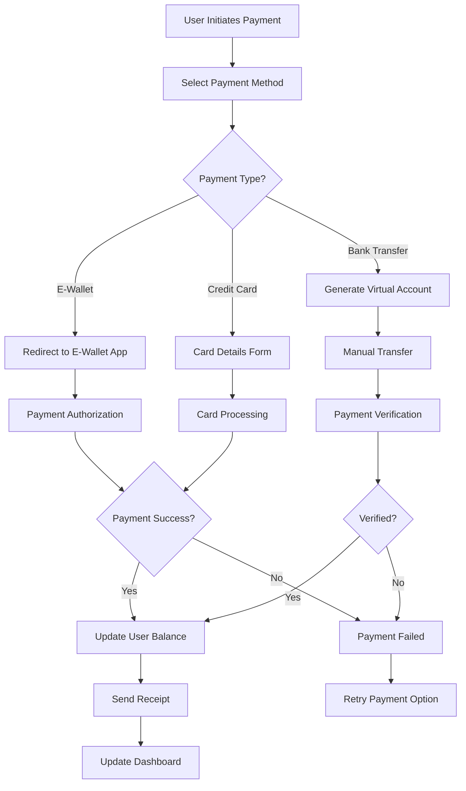

# Yamaha Member - Loyalty Program Platform

## 📋 Overview

Yamaha Member adalah platform loyalty program yang memungkinkan pengguna untuk menyelesaikan berbagai tugas dan mendapatkan reward. Platform ini dirancang khusus untuk komunitas Yamaha Indonesia dengan fitur-fitur modern dan user experience yang optimal.

## 🚀 Features

### User Features
- **Authentication System**: Login/Register dengan validasi email
- **Task Management**: Browse dan complete berbagai jenis tugas
- **Reward System**: Tukar poin dengan merchandise dan voucher
- **Wallet Management**: Kelola saldo reward dan riwayat transaksi
- **Profile Management**: Update profil dan pengaturan akun
- **Achievement System**: Unlock badges dan level progression
- **Notification System**: Real-time notifications untuk aktivitas

### Admin Features
- **Dashboard Analytics**: Comprehensive statistics dan metrics
- **User Management**: Kelola user accounts dan aktivitas
- **Task Management**: Create, edit, dan delete tasks
- **Submission Review**: Approve/reject user submissions
- **Reward Management**: Kelola catalog rewards
- **Transaction Monitoring**: Monitor semua transaksi dan payments

### Technical Features
- **Progressive Web App (PWA)**: Installable dan offline-capable
- **Responsive Design**: Optimal di semua device sizes
- **Real-time Updates**: Live data synchronization
- **Payment Gateway Integration**: Multiple payment methods
- **Indonesian Localization**: Bahasa Indonesia dan format mata uang

## 🛠 Tech Stack

### Frontend
- **React 18** - UI Framework
- **TypeScript** - Type safety
- **Tailwind CSS** - Styling framework
- **Vite** - Build tool dan dev server
- **React Router** - Client-side routing
- **Lucide React** - Icon library
- **Date-fns** - Date manipulation

### Backend (Planned)
- **Node.js** - Runtime environment
- **Express.js** - Web framework
- **PostgreSQL** - Primary database
- **Redis** - Caching dan sessions
- **JWT** - Authentication tokens
- **Multer** - File upload handling

### Payment Integration
- **Midtrans** - Primary payment gateway
- **Xendit** - Alternative payment gateway
- **Bank Transfer** - Manual verification
- **E-Wallet** - GoPay, OVO, DANA, LinkAja

### Infrastructure
- **Docker** - Containerization
- **AWS/GCP** - Cloud hosting
- **CloudFlare** - CDN dan security
- **GitHub Actions** - CI/CD pipeline

## 📁 Project Structure

```
yamaha-member/
├── public/                 # Static assets
├── src/
│   ├── components/        # Reusable UI components
│   │   ├── Layout/       # Layout components (Header, Sidebar, etc.)
│   │   └── UI/           # UI components (Cards, Buttons, etc.)
│   ├── contexts/         # React contexts (Auth, Theme, etc.)
│   ├── data/             # Mock data dan constants
│   ├── hooks/            # Custom React hooks
│   ├── pages/            # Page components
│   │   ├── admin/        # Admin-specific pages
│   │   ├── Auth.tsx      # Authentication page
│   │   ├── Dashboard.tsx # User dashboard
│   │   ├── Tasks.tsx     # Tasks listing
│   │   ├── Rewards.tsx   # Rewards catalog
│   │   └── Profile.tsx   # User profile
│   ├── services/         # API services dan data management
│   ├── types/            # TypeScript type definitions
│   ├── utils/            # Utility functions
│   ├── App.tsx           # Main app component
│   └── main.tsx          # App entry point
├── docs/                 # Documentation files
├── package.json          # Dependencies dan scripts
└── README.md            # Project documentation
```

## 🔄 User Flow Diagrams

### 1. User Registration & Authentication Flow


### 2. Task Completion Flow


### 3. Reward Redemption Flow


### 4. Payment Gateway Integration Flow


## 🔐 Authentication & Authorization

### User Roles
1. **Customer** - Regular users who complete tasks
2. **Admin** - Platform administrators with full access

### Authentication Flow
1. User registers with email/password
2. Email verification (optional)
3. JWT token generation
4. Token stored in localStorage
5. Protected routes check for valid token
6. Automatic token refresh

### Authorization Levels
- **Public**: Landing page, login, register
- **Authenticated**: Dashboard, tasks, rewards, profile
- **Admin Only**: Admin dashboard, user management, task creation

## 💳 Payment Gateway Integration

### Supported Payment Methods

#### 1. E-Wallets
- **GoPay**: Direct integration via Midtrans
- **OVO**: Via Xendit API
- **DANA**: Via Midtrans
- **LinkAja**: Via Xendit API
- **ShopeePay**: Via Midtrans

#### 2. Bank Transfer
- **Virtual Account**: Auto-generated per transaction
- **Manual Transfer**: Admin verification required
- **Internet Banking**: Direct bank integration

#### 3. Credit/Debit Cards
- **Visa/Mastercard**: Via Midtrans
- **JCB**: Via Xendit
- **Local Cards**: BCA, Mandiri, BNI, BRI

### Payment Flow Implementation

```typescript
// Payment service structure
interface PaymentService {
  createPayment(amount: number, method: PaymentMethod): Promise<PaymentResponse>
  verifyPayment(transactionId: string): Promise<VerificationResult>
  handleCallback(payload: CallbackPayload): Promise<void>
  refundPayment(transactionId: string): Promise<RefundResult>
}

// Payment methods enum
enum PaymentMethod {
  GOPAY = 'gopay',
  OVO = 'ovo',
  DANA = 'dana',
  LINKAJA = 'linkaja',
  BANK_TRANSFER = 'bank_transfer',
  CREDIT_CARD = 'credit_card'
}
```

### Security Measures
- **SSL/TLS Encryption**: All payment data encrypted
- **PCI DSS Compliance**: Credit card data protection
- **Webhook Verification**: Signature validation for callbacks
- **Rate Limiting**: Prevent payment abuse
- **Fraud Detection**: Suspicious transaction monitoring

## 📊 Database Schema

### Core Tables

#### Users
```sql
CREATE TABLE users (
  id UUID PRIMARY KEY DEFAULT gen_random_uuid(),
  email VARCHAR(255) UNIQUE NOT NULL,
  name VARCHAR(255) NOT NULL,
  phone VARCHAR(20),
  avatar_url TEXT,
  balance DECIMAL(15,2) DEFAULT 0,
  role user_role DEFAULT 'customer',
  email_verified BOOLEAN DEFAULT false,
  created_at TIMESTAMP DEFAULT NOW(),
  updated_at TIMESTAMP DEFAULT NOW()
);
```

#### Tasks
```sql
CREATE TABLE tasks (
  id UUID PRIMARY KEY DEFAULT gen_random_uuid(),
  title VARCHAR(255) NOT NULL,
  description TEXT NOT NULL,
  reward DECIMAL(10,2) NOT NULL,
  deadline TIMESTAMP NOT NULL,
  category task_category NOT NULL,
  requirements JSONB NOT NULL,
  status task_status DEFAULT 'active',
  created_by UUID REFERENCES users(id),
  created_at TIMESTAMP DEFAULT NOW(),
  updated_at TIMESTAMP DEFAULT NOW()
);
```

#### Submissions
```sql
CREATE TABLE submissions (
  id UUID PRIMARY KEY DEFAULT gen_random_uuid(),
  task_id UUID REFERENCES tasks(id),
  user_id UUID REFERENCES users(id),
  content JSONB NOT NULL,
  status submission_status DEFAULT 'pending',
  submitted_at TIMESTAMP DEFAULT NOW(),
  reviewed_at TIMESTAMP,
  reviewed_by UUID REFERENCES users(id),
  feedback TEXT
);
```

#### Transactions
```sql
CREATE TABLE transactions (
  id UUID PRIMARY KEY DEFAULT gen_random_uuid(),
  user_id UUID REFERENCES users(id),
  type transaction_type NOT NULL,
  amount DECIMAL(15,2) NOT NULL,
  status transaction_status DEFAULT 'pending',
  description TEXT NOT NULL,
  payment_method VARCHAR(50),
  payment_reference VARCHAR(255),
  created_at TIMESTAMP DEFAULT NOW(),
  updated_at TIMESTAMP DEFAULT NOW()
);
```

## 🚀 Deployment Guide

### Development Setup
```bash
# Clone repository
git clone https://github.com/your-org/yamaha-member.git
cd yamaha-member

# Install dependencies
npm install

# Setup environment variables
cp .env.example .env

# Start development server
npm run dev
```

### Production Deployment

#### Using Docker
```dockerfile
FROM node:18-alpine AS builder
WORKDIR /app
COPY package*.json ./
RUN npm ci --only=production

COPY . .
RUN npm run build

FROM nginx:alpine
COPY --from=builder /app/dist /usr/share/nginx/html
COPY nginx.conf /etc/nginx/nginx.conf
EXPOSE 80
CMD ["nginx", "-g", "daemon off;"]
```

#### Environment Variables
```env
# App Configuration
VITE_APP_NAME=Yamaha Member
VITE_APP_URL=https://member.yamaha.co.id
VITE_API_URL=https://api.member.yamaha.co.id

# Payment Gateway
VITE_MIDTRANS_CLIENT_KEY=your_midtrans_client_key
VITE_XENDIT_PUBLIC_KEY=your_xendit_public_key

# Analytics
VITE_GA_TRACKING_ID=your_google_analytics_id
```

## 🧪 Testing Strategy

### Unit Tests
- Component testing with React Testing Library
- Service function testing with Jest
- Utility function testing

### Integration Tests
- API integration testing
- Payment gateway testing
- Database transaction testing

### E2E Tests
- User journey testing with Cypress
- Payment flow testing
- Admin workflow testing

### Performance Testing
- Load testing with Artillery
- Bundle size optimization
- Core Web Vitals monitoring

## 📈 Analytics & Monitoring

### Key Metrics
- **User Engagement**: DAU, MAU, session duration
- **Task Completion**: Completion rates by category
- **Revenue**: Payment volume, average transaction
- **Performance**: Page load times, error rates

### Monitoring Tools
- **Application**: Sentry for error tracking
- **Performance**: Google Analytics, Core Web Vitals
- **Infrastructure**: AWS CloudWatch, Datadog
- **Uptime**: Pingdom, StatusPage

## 🔒 Security Considerations

### Data Protection
- **GDPR Compliance**: User data privacy rights
- **Data Encryption**: At rest and in transit
- **Access Control**: Role-based permissions
- **Audit Logging**: All admin actions logged

### Security Headers
```nginx
add_header X-Frame-Options "SAMEORIGIN" always;
add_header X-Content-Type-Options "nosniff" always;
add_header X-XSS-Protection "1; mode=block" always;
add_header Strict-Transport-Security "max-age=31536000; includeSubDomains" always;
add_header Content-Security-Policy "default-src 'self'; script-src 'self' 'unsafe-inline'; style-src 'self' 'unsafe-inline';" always;
```

## 🚧 Roadmap

### Phase 1 (Current)
- ✅ Basic user authentication
- ✅ Task management system
- ✅ Reward catalog
- ✅ Admin dashboard
- ✅ PWA implementation

### Phase 2 (Next 3 months)
- 🔄 Payment gateway integration
- 🔄 Real-time notifications
- 🔄 Advanced analytics
- 🔄 Mobile app development
- 🔄 API documentation

### Phase 3 (6 months)
- 📋 Social features (leaderboards, sharing)
- 📋 Gamification enhancements
- 📋 Third-party integrations
- 📋 Advanced reporting
- 📋 Multi-language support

### Phase 4 (12 months)
- 📋 AI-powered recommendations
- 📋 Blockchain rewards
- 📋 IoT device integration
- 📋 Advanced fraud detection
- 📋 International expansion

## 🤝 Contributing

### Development Workflow
1. Fork the repository
2. Create feature branch (`git checkout -b feature/amazing-feature`)
3. Commit changes (`git commit -m 'Add amazing feature'`)
4. Push to branch (`git push origin feature/amazing-feature`)
5. Open Pull Request

### Code Standards
- **TypeScript**: Strict mode enabled
- **ESLint**: Airbnb configuration
- **Prettier**: Code formatting
- **Husky**: Pre-commit hooks
- **Conventional Commits**: Commit message format

## 📞 Support

### Documentation
- **API Docs**: https://docs.member.yamaha.co.id
- **User Guide**: https://help.member.yamaha.co.id
- **Developer Guide**: https://dev.member.yamaha.co.id

### Contact
- **Email**: support@yamaha.co.id
- **Phone**: +62-21-1234-5678
- **Slack**: #yamaha-member-support

## 📄 License

This project is licensed under the MIT License - see the [LICENSE](LICENSE) file for details.

---

**Yamaha Member Platform** - Empowering the Yamaha Community through Rewards and Engagement