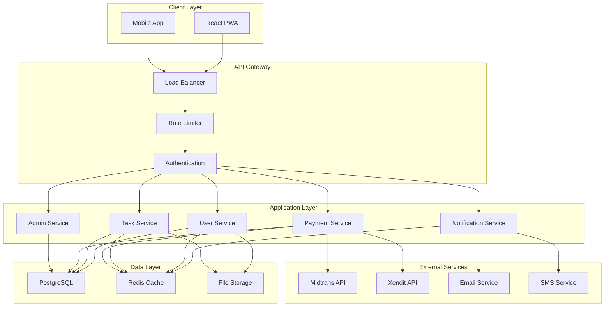
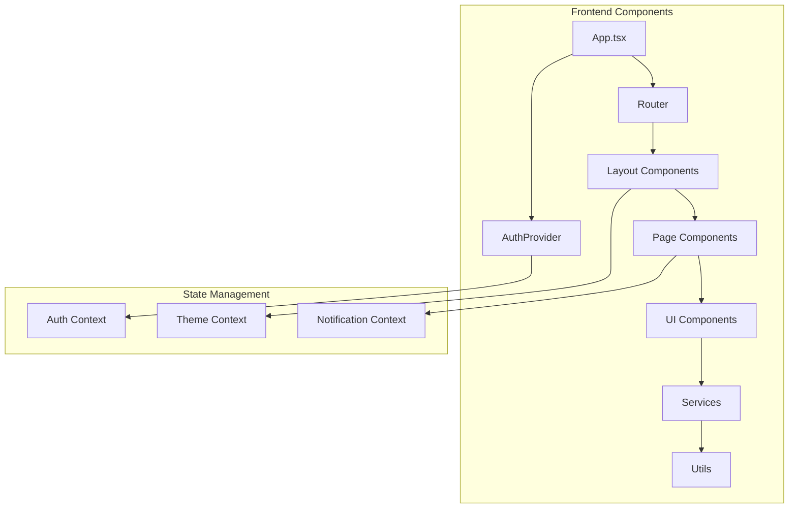
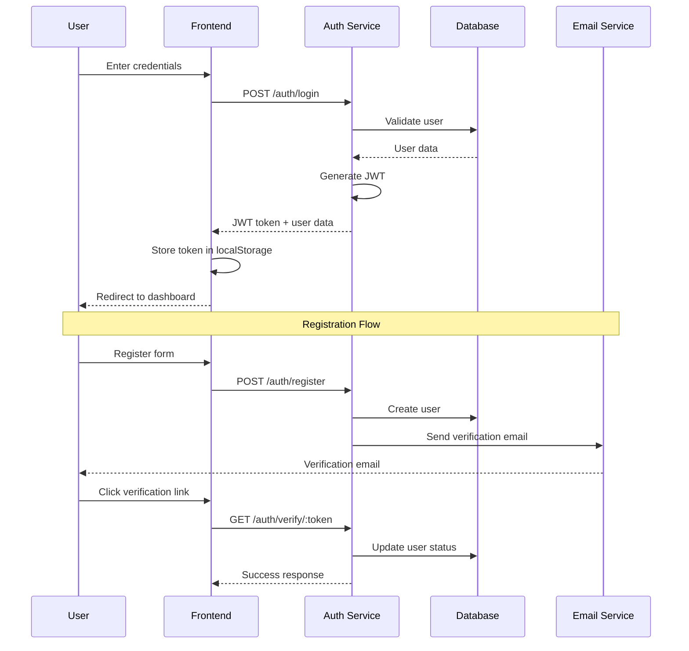
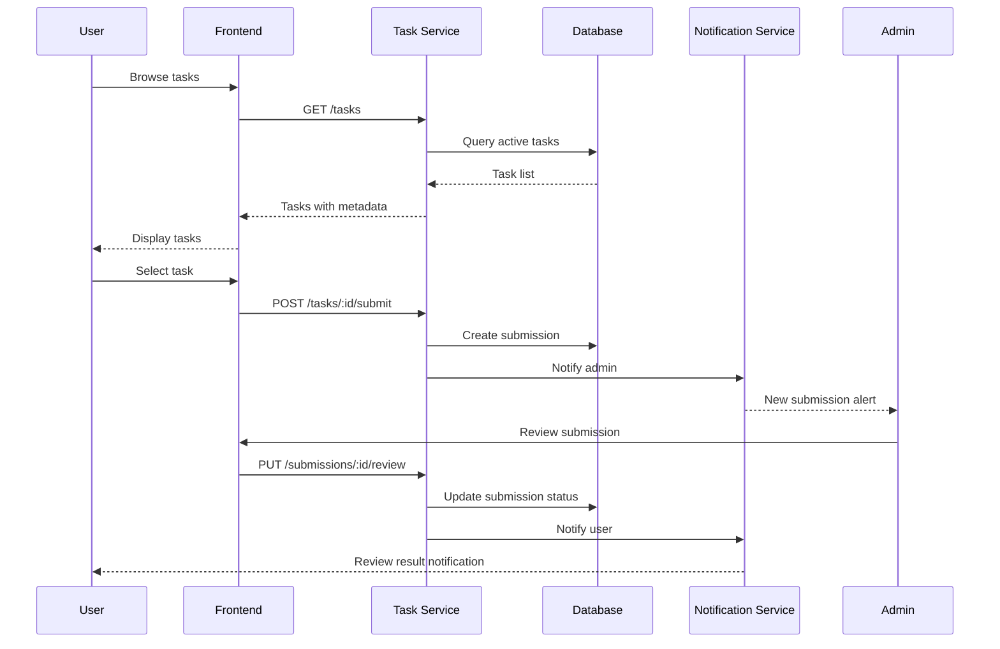
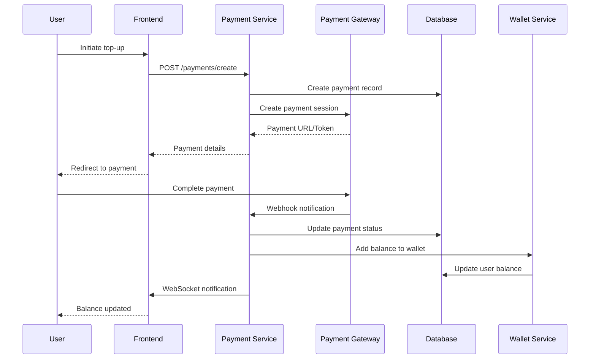
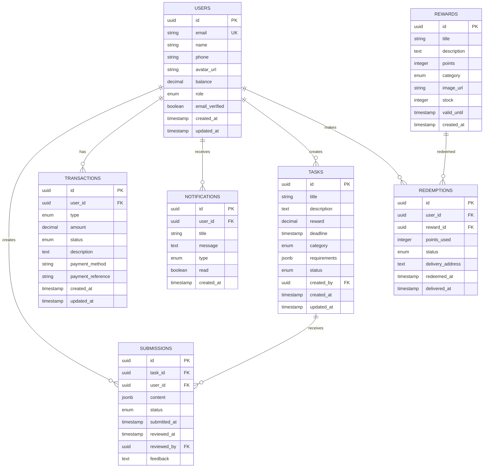

# Technical Documentation - Yamaha Member Platform

## 🏗 Architecture Overview

### System Architecture


### Component Architecture


## 🔄 Data Flow Diagrams

### 1. User Authentication Flow


### 2. Task Management Flow


### 3. Payment Processing Flow


## 🗄 Database Design

### Entity Relationship Diagram


### Database Indexes
```sql
-- Performance indexes
CREATE INDEX idx_users_email ON users(email);
CREATE INDEX idx_users_role ON users(role);
CREATE INDEX idx_tasks_status ON tasks(status);
CREATE INDEX idx_tasks_category ON tasks(category);
CREATE INDEX idx_tasks_deadline ON tasks(deadline);
CREATE INDEX idx_submissions_user_id ON submissions(user_id);
CREATE INDEX idx_submissions_task_id ON submissions(task_id);
CREATE INDEX idx_submissions_status ON submissions(status);
CREATE INDEX idx_transactions_user_id ON transactions(user_id);
CREATE INDEX idx_transactions_type ON transactions(type);
CREATE INDEX idx_transactions_status ON transactions(status);
CREATE INDEX idx_notifications_user_id ON notifications(user_id);
CREATE INDEX idx_notifications_read ON notifications(read);

-- Composite indexes
CREATE INDEX idx_tasks_status_category ON tasks(status, category);
CREATE INDEX idx_submissions_user_status ON submissions(user_id, status);
CREATE INDEX idx_transactions_user_type ON transactions(user_id, type);
```

## 🔌 API Documentation

### Authentication Endpoints

#### POST /auth/register
```typescript
interface RegisterRequest {
  name: string;
  email: string;
  password: string;
  phone?: string;
}

interface RegisterResponse {
  success: boolean;
  message: string;
  user?: {
    id: string;
    name: string;
    email: string;
    role: string;
  };
}
```

#### POST /auth/login
```typescript
interface LoginRequest {
  email: string;
  password: string;
}

interface LoginResponse {
  success: boolean;
  token: string;
  user: {
    id: string;
    name: string;
    email: string;
    role: string;
    balance: number;
  };
}
```

### Task Management Endpoints

#### GET /tasks
```typescript
interface TasksQuery {
  category?: string;
  status?: string;
  search?: string;
  page?: number;
  limit?: number;
}

interface TasksResponse {
  tasks: Task[];
  pagination: {
    page: number;
    limit: number;
    total: number;
    totalPages: number;
  };
}
```

#### POST /tasks/:id/submit
```typescript
interface SubmissionRequest {
  content: {
    text?: string;
    images?: string[];
    videos?: string[];
  };
}

interface SubmissionResponse {
  success: boolean;
  submission: {
    id: string;
    taskId: string;
    status: string;
    submittedAt: string;
  };
}
```

### Payment Endpoints

#### POST /payments/create
```typescript
interface PaymentRequest {
  amount: number;
  method: 'gopay' | 'ovo' | 'dana' | 'bank_transfer' | 'credit_card';
  returnUrl?: string;
}

interface PaymentResponse {
  success: boolean;
  paymentId: string;
  paymentUrl?: string;
  qrCode?: string;
  virtualAccount?: string;
  expiresAt: string;
}
```

#### POST /payments/webhook
```typescript
interface WebhookPayload {
  paymentId: string;
  status: 'pending' | 'success' | 'failed' | 'expired';
  amount: number;
  paidAt?: string;
  signature: string;
}
```

## 🔐 Security Implementation

### Authentication & Authorization
```typescript
// JWT Token Structure
interface JWTPayload {
  userId: string;
  email: string;
  role: 'customer' | 'admin';
  iat: number;
  exp: number;
}

// Middleware for protected routes
const authenticateToken = (req: Request, res: Response, next: NextFunction) => {
  const authHeader = req.headers['authorization'];
  const token = authHeader && authHeader.split(' ')[1];
  
  if (!token) {
    return res.status(401).json({ error: 'Access token required' });
  }
  
  jwt.verify(token, process.env.JWT_SECRET!, (err, user) => {
    if (err) return res.status(403).json({ error: 'Invalid token' });
    req.user = user as JWTPayload;
    next();
  });
};

// Role-based access control
const requireRole = (roles: string[]) => {
  return (req: Request, res: Response, next: NextFunction) => {
    if (!roles.includes(req.user.role)) {
      return res.status(403).json({ error: 'Insufficient permissions' });
    }
    next();
  };
};
```

### Input Validation
```typescript
import Joi from 'joi';

// User registration validation
const registerSchema = Joi.object({
  name: Joi.string().min(2).max(100).required(),
  email: Joi.string().email().required(),
  password: Joi.string().min(8).pattern(/^(?=.*[a-z])(?=.*[A-Z])(?=.*\d)/).required(),
  phone: Joi.string().pattern(/^(\+62|62|0)8[1-9][0-9]{6,9}$/).optional()
});

// Task submission validation
const submissionSchema = Joi.object({
  content: Joi.object({
    text: Joi.string().max(5000).optional(),
    images: Joi.array().items(Joi.string().uri()).max(10).optional(),
    videos: Joi.array().items(Joi.string().uri()).max(3).optional()
  }).required()
});
```

### Rate Limiting
```typescript
import rateLimit from 'express-rate-limit';

// General API rate limiting
const apiLimiter = rateLimit({
  windowMs: 15 * 60 * 1000, // 15 minutes
  max: 100, // limit each IP to 100 requests per windowMs
  message: 'Too many requests from this IP'
});

// Strict rate limiting for auth endpoints
const authLimiter = rateLimit({
  windowMs: 15 * 60 * 1000,
  max: 5, // limit each IP to 5 requests per windowMs
  skipSuccessfulRequests: true
});

// Payment endpoint rate limiting
const paymentLimiter = rateLimit({
  windowMs: 60 * 1000, // 1 minute
  max: 3, // limit each IP to 3 payment requests per minute
  keyGenerator: (req) => req.user?.userId || req.ip
});
```

## 💳 Payment Gateway Integration

### Midtrans Integration
```typescript
class MidtransService {
  private snap: any;
  
  constructor() {
    this.snap = new midtransClient.Snap({
      isProduction: process.env.NODE_ENV === 'production',
      serverKey: process.env.MIDTRANS_SERVER_KEY,
      clientKey: process.env.MIDTRANS_CLIENT_KEY
    });
  }
  
  async createTransaction(params: PaymentParams): Promise<PaymentResponse> {
    const parameter = {
      transaction_details: {
        order_id: params.orderId,
        gross_amount: params.amount
      },
      customer_details: {
        first_name: params.customerName,
        email: params.customerEmail,
        phone: params.customerPhone
      },
      enabled_payments: params.paymentMethods,
      callbacks: {
        finish: `${process.env.APP_URL}/payment/finish`,
        error: `${process.env.APP_URL}/payment/error`,
        pending: `${process.env.APP_URL}/payment/pending`
      }
    };
    
    try {
      const transaction = await this.snap.createTransaction(parameter);
      return {
        success: true,
        token: transaction.token,
        redirectUrl: transaction.redirect_url
      };
    } catch (error) {
      throw new Error(`Midtrans error: ${error.message}`);
    }
  }
  
  async verifySignature(payload: any, signature: string): Promise<boolean> {
    const serverKey = process.env.MIDTRANS_SERVER_KEY;
    const orderId = payload.order_id;
    const statusCode = payload.status_code;
    const grossAmount = payload.gross_amount;
    
    const signatureKey = crypto
      .createHash('sha512')
      .update(orderId + statusCode + grossAmount + serverKey)
      .digest('hex');
    
    return signatureKey === signature;
  }
}
```

### Xendit Integration
```typescript
class XenditService {
  private xendit: any;
  
  constructor() {
    this.xendit = new Xendit({
      secretKey: process.env.XENDIT_SECRET_KEY
    });
  }
  
  async createEWalletCharge(params: EWalletParams): Promise<PaymentResponse> {
    try {
      const charge = await this.xendit.EWallet.createEWalletCharge({
        reference_id: params.referenceId,
        currency: 'IDR',
        amount: params.amount,
        checkout_method: 'ONE_TIME_PAYMENT',
        channel_code: params.channelCode, // OVO, DANA, LINKAJA
        channel_properties: {
          mobile_number: params.mobileNumber,
          success_redirect_url: params.successUrl,
          failure_redirect_url: params.failureUrl
        }
      });
      
      return {
        success: true,
        chargeId: charge.id,
        actions: charge.actions
      };
    } catch (error) {
      throw new Error(`Xendit error: ${error.message}`);
    }
  }
  
  async createVirtualAccount(params: VAParams): Promise<PaymentResponse> {
    try {
      const va = await this.xendit.VirtualAcc.createFixedVA({
        external_id: params.externalId,
        bank_code: params.bankCode,
        name: params.customerName,
        expected_amount: params.amount,
        expiration_date: params.expirationDate
      });
      
      return {
        success: true,
        accountNumber: va.account_number,
        bankCode: va.bank_code,
        expirationDate: va.expiration_date
      };
    } catch (error) {
      throw new Error(`Xendit VA error: ${error.message}`);
    }
  }
}
```

### Payment Webhook Handler
```typescript
class PaymentWebhookHandler {
  async handleMidtransWebhook(payload: any, signature: string) {
    const midtrans = new MidtransService();
    
    if (!await midtrans.verifySignature(payload, signature)) {
      throw new Error('Invalid signature');
    }
    
    const orderId = payload.order_id;
    const transactionStatus = payload.transaction_status;
    const fraudStatus = payload.fraud_status;
    
    let paymentStatus: PaymentStatus;
    
    if (transactionStatus === 'capture') {
      paymentStatus = fraudStatus === 'challenge' ? 'pending' : 'success';
    } else if (transactionStatus === 'settlement') {
      paymentStatus = 'success';
    } else if (['cancel', 'deny', 'expire'].includes(transactionStatus)) {
      paymentStatus = 'failed';
    } else {
      paymentStatus = 'pending';
    }
    
    await this.updatePaymentStatus(orderId, paymentStatus, payload);
  }
  
  async handleXenditWebhook(payload: any, signature: string) {
    const xendit = new XenditService();
    
    if (!xendit.verifyWebhookSignature(payload, signature)) {
      throw new Error('Invalid signature');
    }
    
    const externalId = payload.external_id;
    const status = payload.status;
    
    let paymentStatus: PaymentStatus;
    
    switch (status) {
      case 'SUCCEEDED':
        paymentStatus = 'success';
        break;
      case 'FAILED':
        paymentStatus = 'failed';
        break;
      default:
        paymentStatus = 'pending';
    }
    
    await this.updatePaymentStatus(externalId, paymentStatus, payload);
  }
  
  private async updatePaymentStatus(
    orderId: string, 
    status: PaymentStatus, 
    payload: any
  ) {
    const transaction = await Transaction.findOne({ 
      where: { payment_reference: orderId } 
    });
    
    if (!transaction) {
      throw new Error('Transaction not found');
    }
    
    transaction.status = status;
    transaction.updated_at = new Date();
    await transaction.save();
    
    if (status === 'success') {
      await this.processSuccessfulPayment(transaction);
    }
    
    // Send real-time notification
    await this.notifyUser(transaction.user_id, status, payload);
  }
  
  private async processSuccessfulPayment(transaction: Transaction) {
    // Add balance to user wallet
    const user = await User.findByPk(transaction.user_id);
    user.balance += transaction.amount;
    await user.save();
    
    // Create wallet transaction record
    await Transaction.create({
      user_id: transaction.user_id,
      type: 'credit',
      amount: transaction.amount,
      status: 'completed',
      description: 'Top up via payment gateway'
    });
    
    // Send confirmation email
    await EmailService.sendPaymentConfirmation(user.email, transaction);
  }
}
```

## 📱 PWA Implementation

### Service Worker Configuration
```typescript
// sw.js
const CACHE_NAME = 'yamaha-member-v1';
const urlsToCache = [
  '/',
  '/static/js/bundle.js',
  '/static/css/main.css',
  '/manifest.json'
];

self.addEventListener('install', (event) => {
  event.waitUntil(
    caches.open(CACHE_NAME)
      .then((cache) => cache.addAll(urlsToCache))
  );
});

self.addEventListener('fetch', (event) => {
  event.respondWith(
    caches.match(event.request)
      .then((response) => {
        // Return cached version or fetch from network
        return response || fetch(event.request);
      })
  );
});

// Push notification handling
self.addEventListener('push', (event) => {
  const options = {
    body: event.data.text(),
    icon: '/icon-192x192.png',
    badge: '/badge-72x72.png',
    vibrate: [100, 50, 100],
    data: {
      dateOfArrival: Date.now(),
      primaryKey: 1
    },
    actions: [
      {
        action: 'explore',
        title: 'View Details',
        icon: '/images/checkmark.png'
      },
      {
        action: 'close',
        title: 'Close',
        icon: '/images/xmark.png'
      }
    ]
  };
  
  event.waitUntil(
    self.registration.showNotification('Yamaha Member', options)
  );
});
```

### Web App Manifest
```json
{
  "name": "Yamaha Member",
  "short_name": "YamahaMember",
  "description": "Yamaha Indonesia Loyalty Program",
  "start_url": "/",
  "display": "standalone",
  "background_color": "#003399",
  "theme_color": "#003399",
  "orientation": "portrait-primary",
  "icons": [
    {
      "src": "/icon-72x72.png",
      "sizes": "72x72",
      "type": "image/png"
    },
    {
      "src": "/icon-96x96.png",
      "sizes": "96x96",
      "type": "image/png"
    },
    {
      "src": "/icon-128x128.png",
      "sizes": "128x128",
      "type": "image/png"
    },
    {
      "src": "/icon-144x144.png",
      "sizes": "144x144",
      "type": "image/png"
    },
    {
      "src": "/icon-152x152.png",
      "sizes": "152x152",
      "type": "image/png"
    },
    {
      "src": "/icon-192x192.png",
      "sizes": "192x192",
      "type": "image/png"
    },
    {
      "src": "/icon-384x384.png",
      "sizes": "384x384",
      "type": "image/png"
    },
    {
      "src": "/icon-512x512.png",
      "sizes": "512x512",
      "type": "image/png"
    }
  ],
  "categories": ["lifestyle", "productivity"],
  "screenshots": [
    {
      "src": "/screenshot1.png",
      "sizes": "1280x720",
      "type": "image/png"
    }
  ]
}
```

## 🚀 Performance Optimization

### Code Splitting
```typescript
// Lazy loading components
const Dashboard = lazy(() => import('./pages/Dashboard'));
const Tasks = lazy(() => import('./pages/Tasks'));
const Rewards = lazy(() => import('./pages/Rewards'));
const Profile = lazy(() => import('./pages/Profile'));
const AdminDashboard = lazy(() => import('./pages/admin/AdminDashboard'));

// Route-based code splitting
function App() {
  return (
    <Router>
      <AuthProvider>
        <Suspense fallback={<LoadingSpinner />}>
          <Routes>
            <Route path="/dashboard" element={<Dashboard />} />
            <Route path="/tasks" element={<Tasks />} />
            <Route path="/rewards" element={<Rewards />} />
            <Route path="/profile" element={<Profile />} />
            <Route path="/admin" element={<AdminDashboard />} />
          </Routes>
        </Suspense>
      </AuthProvider>
    </Router>
  );
}
```

### Image Optimization
```typescript
// Image lazy loading component
const LazyImage: React.FC<ImageProps> = ({ src, alt, className }) => {
  const [isLoaded, setIsLoaded] = useState(false);
  const [isInView, setIsInView] = useState(false);
  const imgRef = useRef<HTMLImageElement>(null);
  
  useEffect(() => {
    const observer = new IntersectionObserver(
      ([entry]) => {
        if (entry.isIntersecting) {
          setIsInView(true);
          observer.disconnect();
        }
      },
      { threshold: 0.1 }
    );
    
    if (imgRef.current) {
      observer.observe(imgRef.current);
    }
    
    return () => observer.disconnect();
  }, []);
  
  return (
    <div ref={imgRef} className={className}>
      {isInView && (
         setIsLoaded(true)}
          className={`transition-opacity duration-300 ${
            isLoaded ? 'opacity-100' : 'opacity-0'
          }`}
        />
      )}
    </div>
  );
};
```

### Caching Strategy
```typescript
// API response caching
class ApiCache {
  private cache = new Map<string, { data: any; timestamp: number }>();
  private ttl = 5 * 60 * 1000; // 5 minutes
  
  get(key: string): any | null {
    const cached = this.cache.get(key);
    if (!cached) return null;
    
    if (Date.now() - cached.timestamp > this.ttl) {
      this.cache.delete(key);
      return null;
    }
    
    return cached.data;
  }
  
  set(key: string, data: any): void {
    this.cache.set(key, {
      data,
      timestamp: Date.now()
    });
  }
  
  clear(): void {
    this.cache.clear();
  }
}

// Usage in data service
class DataService {
  private cache = new ApiCache();
  
  async getTasks(filters?: TaskFilters): Promise<Task[]> {
    const cacheKey = `tasks_${JSON.stringify(filters)}`;
    const cached = this.cache.get(cacheKey);
    
    if (cached) {
      return cached;
    }
    
    const tasks = await this.fetchTasks(filters);
    this.cache.set(cacheKey, tasks);
    
    return tasks;
  }
}
```

## 📊 Monitoring & Analytics

### Error Tracking with Sentry
```typescript
import * as Sentry from '@sentry/react';

Sentry.init({
  dsn: process.env.REACT_APP_SENTRY_DSN,
  environment: process.env.NODE_ENV,
  integrations: [
    new Sentry.BrowserTracing(),
  ],
  tracesSampleRate: 1.0,
});

// Custom error boundary
const ErrorBoundary = Sentry.withErrorBoundary(App, {
  fallback: ({ error, resetError }) => (
    <div className="error-boundary">
      <h2>Something went wrong</h2>
      <p>{error.message}</p>
      <button onClick={resetError}>Try again</button>
    </div>
  ),
});
```

### Performance Monitoring
```typescript
// Web Vitals tracking
import { getCLS, getFID, getFCP, getLCP, getTTFB } from 'web-vitals';

function sendToAnalytics(metric: any) {
  // Send to Google Analytics
  gtag('event', metric.name, {
    event_category: 'Web Vitals',
    value: Math.round(metric.name === 'CLS' ? metric.value * 1000 : metric.value),
    event_label: metric.id,
    non_interaction: true,
  });
}

getCLS(sendToAnalytics);
getFID(sendToAnalytics);
getFCP(sendToAnalytics);
getLCP(sendToAnalytics);
getTTFB(sendToAnalytics);
```

### Custom Analytics Events
```typescript
class Analytics {
  static trackEvent(eventName: string, properties?: Record<string, any>) {
    // Google Analytics
    gtag('event', eventName, properties);
    
    // Custom analytics
    if (window.customAnalytics) {
      window.customAnalytics.track(eventName, properties);
    }
  }
  
  static trackPageView(pageName: string) {
    gtag('config', 'GA_MEASUREMENT_ID', {
      page_title: pageName,
      page_location: window.location.href
    });
  }
  
  static trackUserAction(action: string, category: string, label?: string) {
    this.trackEvent('user_action', {
      action,
      category,
      label,
      timestamp: Date.now()
    });
  }
}

// Usage in components
const TaskCard = ({ task, onTakeTask }) => {
  const handleTakeTask = () => {
    Analytics.trackUserAction('take_task', 'tasks', task.category);
    onTakeTask(task.id);
  };
  
  return (
    <div onClick={handleTakeTask}>
      {/* Task card content */}
    </div>
  );
};
```

This technical documentation provides a comprehensive overview of the system architecture, implementation details, and best practices for the Yamaha Member platform. It serves as a reference for developers working on the project and includes all necessary information for payment gateway integration and system scaling.